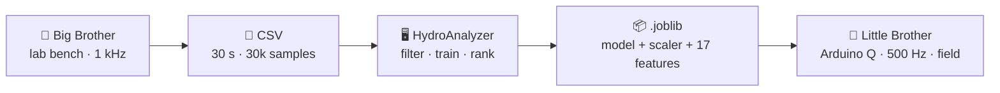

<div align="center">

# 💧 HydraDetect-AI

### _Stolen water leaves an echo._

Detecting **clandestine water-bypass connections** with a controlled **water hammer** and **machine learning** — from the laboratory bench to the point on the street.

[](https://andyrcc.github.io/HydraDetect-AI/)


[**▶ Open the live demo →**](https://andyrcc.github.io/HydraDetect-AI/)

</div>

---

## The problem

A **clandestine bypass** is an illegal branch installed downstream of a legal water connection. The meter keeps reading, the branch is buried, and its hydraulic signature hides under normal demand — so conventional location tools rarely find it. Worldwide, ~126 billion m³ of non-revenue water is lost every year, and in many Latin American utilities unauthorized consumption is the leading cause.

**The question:** _can a pressure wave, read by a single sensor, give away a T-junction nobody can see?_

## How it works

A sharp valve closure fires a controlled water hammer. The pressure front races down the pipe; a hidden T-junction reflects a **negative echo** whose arrival time encodes the bypass distance. Four models read that echo and return an explainable verdict.

> `ΔP = ρ·a·ΔV` &nbsp;•&nbsp; `a ≈ 677 m/s` (Korteweg–Joukowsky) &nbsp;•&nbsp; echo at `t = 2·Lᵦ / a` &nbsp;•&nbsp; reflection `r = −1/3`



## Results

| Validation | Detail | Result |
| :--- | :--- | :--- |
| **Synthetic** (test set) | Random Forest / SVM-RBF / consensus | **0.971 / 0.962 / 0.967** acc |
| **Field pilot** (n = 36) | lab-trained model → field device | **89 %** acc |
| **Echo** (bypass @ 3 m) | measured vs. Joukowsky theory | **8.4 ± 0.4 ms** ≈ 8.86 ms |
| **Explainability** | vs. a 1-D CNN baseline (91.5 %) | wins — ~10× less data, interpretable |

## The two programs

### 🖥️ HydroAnalyzer — _train_ (desktop)
PyQt5 application that carries the raw signal all the way to the exported model in one window: physical simulator, **6-stage filtering**, synthetic + real training, **4 models** (RF · SVM-RBF · XGBoost · LightGBM) under 5-fold cross-validation, deep analysis, and a single-file `.joblib` export.

### 📲 HydraDetect-AI / Little Brother — _detect_ (field)
An **Arduino Q** (Linux class) runs the FastAPI backend, samples the line at **500 Hz**, and runs the **same 17-feature extractor** as the desktop — bit-exact between training and inference. Soft-voting ensemble; if the models disagree, the verdict is _inconclusive_ and a retest is suggested. The technician only needs a phone.

## Repository

```
HydraDetect-AI/
├── index.html                     # interactive project page (the live demo)
├── detector/                      # in-browser detector — upload a CSV, get a verdict
│   ├── index.html
│   └── samples/                   # ready-to-try sample CSVs (bypass / normal)
├── backend/                       # FastAPI inference service (deployed on Render)
│   ├── app.py                     # POST /api/analyze · filtering + RF/SVM voting
│   ├── model/soldado_goku.joblib  # bundled default model
│   ├── Dockerfile · render.yaml · requirements.txt
│   └── README.md
├── models/                        # trained voting ensembles by pressure range (.joblib)
│   ├── soldado_goku.joblib        # default — RF + SVM
│   └── Freezer(mejorado).joblib · cell(mejorado).joblib · buu-1-1.5.joblib
├── data/training/                 # labeled acquisitions — bypass_data / no_bypass_data / test_data
├── downloads/
│   ├── install.exe                            # HydroAnalyzer desktop installer (Windows)
│   └── HydraDetectAI-LittleBrother-win64.zip  # Arduino App Lab field project
└── sources/
    └── instalador.py              # desktop-app installer build script
```

> The packaged desktop app (`instalador.exe`) is published on the [**Releases**](https://github.com/AndyRCC/HydraDetect-AI/releases) page.

## Getting started

**Just want to try it?** Open the [live demo](https://andyrcc.github.io/HydraDetect-AI/) or jump straight into the [browser detector](https://andyrcc.github.io/HydraDetect-AI/detector/) — upload one of the bundled sample CSVs and read the verdict.

**Desktop app (Windows).** Download `instalador.exe` from the [Releases](https://github.com/AndyRCC/HydraDetect-AI/releases) page and run it — no Python setup required.

**Field device.** Import [`HydraDetectAI-LittleBrother-win64.zip`](downloads/) into the Arduino App Lab and flash it to the Arduino Q.

**Run the inference backend yourself.**

```bash
cd backend
pip install -r requirements.txt
python app.py            # serves FastAPI on :8000  (Dockerfile + render.yaml included)
```

See [`backend/README.md`](backend/README.md) for the API and deployment details.

## Authors

**Andy Casafranca** · **Renzo Albatrino** · **César Medina** · **Dante Vargas**
School of Mechatronics Engineering — Universidad Peruana de Ciencias Aplicadas (UPC), Lima, Peru

<div align="center">

<sub>© 2026 · <code>cyan = signal</code> · <code>amber = bypass</code></sub>

</div>
